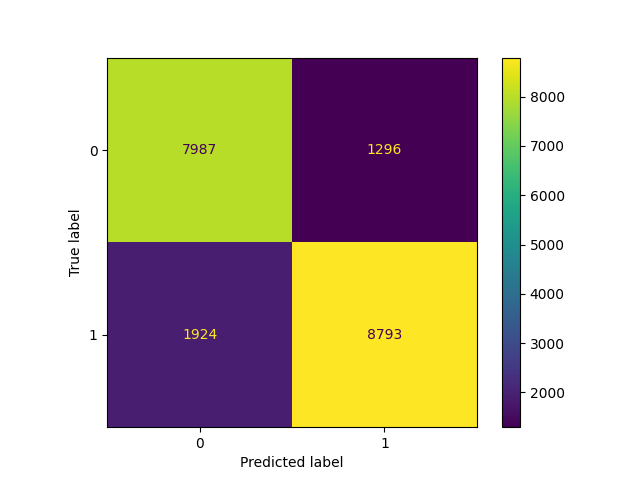

#  Desarrollo de Modelos de Machine Learning

Este documento describe detalladamente el proceso de desarrollo de modelos de *machine learning*, desde la limpieza de datos hasta la evaluación de modelos, pasando por el análisis exploratorio, ingeniería de características y generación de métricas. El proyecto se implementó en dos cuadernos Jupyter:

* `001_EDA.ipynb`: análisis exploratorio y limpieza de datos.
* `002_model.ipynb`: entrenamiento y evaluación de modelos.

---

## Objetivo del Proyecto

Desarrollar y comparar distintos modelos de clasificación binaria para predecir la variable `condition` (si un producto es nuevo o usado) utilizando un dataset de MercadoLibre. Se aplicaron técnicas de EDA, limpieza avanzada, ingeniería de variables, codificación y entrenamiento con distintos algoritmos.

El dataset final, listo para modelado, fue guardado como `data_clean.csv`.

---

## Análisis Exploratorio de Datos (EDA)

**Ubicación:** `notebooks/001_EDA.ipynb`

### 1. Carga de Datos

* Fuente: `MLA_100k.jsonlines` (100,000 registros, 48 columnas), incluyendo información sobre productos como precio, estado (`condition`), métodos de envío, ubicación del vendedor, entre otros
* Origen: El dataset proviene de una empresa de comercio electrónico y contiene diversa información sobre los productos disponibles en su plataforma.

### 2. Información General

* Se revisaron tipos de datos y valores nulos (`df.info()`).
* Columnas con nulos: `warranty`, `seller_contact`, `official_store_id`, etc.

### 3. Distribución de la Variable Objetivo

* Se graficó la distribución de `condition` (nuevo vs. usado) con un gráfico de barras, revelando un posible desbalance de clases que podría requerir atención durante el modelado.

### 4. Selección Preliminar de Variables

* **Directas:** `price`, `base_price`, `sold_quantity`, `available_quantity`(numéricas, sin necesidad de transformación)
* **Transformables:**  `shipping`, `pictures`, `title`, `seller_address`(requieren procesamiento para extraer información útil)

---

## Limpieza de Datos

### 1. Validaciones Iniciales

* Conversión de fechas: `start_time`, `stop_time` a formato `datetime`.

### 2. Manejo de Nulos

* Columnas con demasiados nulos fueron descartadas.
* Se creó la variable binaria `has_warranty` a partir de `warranty`.
* La columna `state` fue imputada con la categoría `"Unknown"`.

### 3. Eliminación de Columnas Irrelevantes

* Se descartaron variables con:

  * Alta cardinalidad o poca varianza
  * Redundancia
  * Ausencia total de datos útiles

### 4. Transformación de Variables

* `picture_count`: calculado a partir de la longitud de la lista en `pictures`.
* `title_length`: número de palabras en el título.
* Variables categóricas como `state`, `buying_mode`, `listing_type_id` codificadas con *one-hot encoding*.
* La variable objetivo `condition`: codificada como 0 (usado) y 1 (nuevo).

### 5. Validación de Consistencia

* Se eliminaron registros inconsistentes.
* Las variables fueron normalizadas (nombres limpios y categorías bien definidas).

### 6. Selección Final de Variables

* Numéricas: `price`, `base_price`, `sold_quantity`, `available_quantity`, `picture_count`, `title_length`.
* Binarias: `has_warranty`, `free_shipping`.
* Categóricas codificadas: `state`, `buying_mode`, `listing_type_id`.
* Objetivo: `condition`.

### 7. Exportación del Dataset Limpio 

* Archivo: `data_clean.csv`
* Ruta: `/data/data_clean.csv`

---

## Mejoras Clave Implementadas

* Manejo Inteligente de Nulos: En lugar de imputación ciega, se crearon variables binarias o se agruparon categorías.
* Reducción de Cardinalidad: Agrupación de valores raros en "Other" para mejorar la generalización del modelo.
* Eliminación Justificada de Columnas: Basado en proporción de nulos, cardinalidad, redundancia o irrelevancia.
* Validaciones Finales: Datos verificados para consistencia, duplicados y formato.

---

##  Ingeniería de Características

* **Escalado Numérico:** `StandardScaler` sin centrar la media (`with_mean=False`), preservando la esparsidad
* **Codificación Categórica:** Categóricas: Se utilizó `OneHotEncoder` para `state`, `buying_mode` y `listing_type_id` (ya codificados en data_clean.csv)
* **División de Datos:** 80% entrenamiento, 20% prueba, con `train_test_split(random_state=42)` para garantizar reproducibilidad

---

##  Entrenamiento de Modelos

**Ubicación:** `notebooks/002_model.ipynb`

Se evaluaron múltiples modelos usando una tubería (modelPipeline) que integraba preprocesamiento y entrenamiento. Se entrenaron los siguientes algoritmos:

* **Logistic Regression:** Modelo lineal para clasificación binaria
* **MLP (Perceptrón Multicapa):** Red neuronal con capas ocultas, capaz de aprender patrones no lineales complejos
* **Decision Tree:** basado en la división recursiva del espacio de características; propenso al sobreajuste
* **Random Forest:** Ensamble de árboles de decisión entrenados con muestras aleatorias del dataset (bagging)
* **XGBoost:** Algoritmo de boosting basado en árboles que entrena modelos secuencialmente para corregir errores de los anteriores. eficiente y preciso, ideal para datos estructurados
* **SVC:** Clasificador que maximiza la separación entre clases; eficaz con datos complejos
* **KNeighbors:** Clasifica según los vecinos más cercanos; simple pero sensible a la escala y a la elección de K
* **Gaussian Naive Bayes:** Modelo probabilístico rápido que asume independencia entre variables

---

## Evaluación de Modelos

###  Métricas Comparativas

| Modelo              | F1 Score   | Precision  | Recall     | Accuracy   |
| ------------------- | ---------- | ---------- | ---------- | ---------- |
| Logistic Regression | 0.7919     | 0.6745     | 0.9589     | 0.7300     |
| MLP                 | 0.7959     | 0.9083     | 0.7083     | 0.8054     |
| Decision Tree       | 0.8071     | 0.8367     | 0.7796     | 0.8004     |
| Random Forest       | 0.8354     | 0.8501     | 0.8213     | 0.8266     |
| **XGBoost**         | **0.8452** | **0.8715** | **0.8204** | **0.8390** |
| SVC                 | 0.7936     | 0.6829     | 0.9471     | 0.7361     |
| KNeighbors          | 0.8209     | 0.8392     | 0.8034     | 0.8122     |
| GaussianNB          | 0.4458     | 0.8970     | 0.2966     | 0.6048     |

 **XGBoost fue el mejor modelo**, con el F1 más alto, buen balance entre precisión y recall, y excelente accuracy

---

## Evaluación Final del Modelo XGBoost

### Matriz de Confusión

* **Verdaderos Positivos (TP)**: 8793
* **Verdaderos Negativos (TN)**: 7987
* **Falsos Positivos (FP)**: 1296
* **Falsos Negativos (FN)**: 1924

Interpretacion: 
* La alta proporción de TN y TP indica que XGBoost es efectivo para distinguir entre productos nuevos y usados
* Los errores (FP y FN) sugieren que el modelo podría beneficiarse de técnicas para abordar el desbalance de clases (por ejemplo, SMOTE) o ajuste de hiperparámetros

### Curva ROC

* **AUC = 0.9243**

La curva ROC demuestra que el modelo tiene **gran capacidad de discriminación**. Cuanto más se acerca el AUC a 1, mejor el rendimiento. En este caso, **AUC = 0.9243**

---

##  Conclusiones

* El proceso de limpieza y transformación permitió convertir campos complejos y nulos en variables significativas para el modelo.
* El modelo XGBoost superó a los demás clasificadores, con excelente balance entre precisión (87.15%) y recall (82.04%).
* La matriz de confusión muestra un desempeño robusto con más de 16,700 predicciones correctas y pocos falsos positivos y negativos, lo que valida su uso para predicciones en un contexto real
* La curva ROC y el AUC de 0.92 validan que el modelo distingue muy bien entre productos nuevos y usados.
* El sistema puede implementarse en producción para automatizar la detección de condición de productos, optimizando alertas, recomendaciones y validaciones de calidad.
* El modelo XGBoost es intensivo, lo que podría limitar su uso en entornos con recursos restringidos (tiene un alto costo computacional) 

---

##  Futuro del Proyecto

* Afinar hiperparámetros de XGBoost con búsqueda bayesiana para optimizar el modelo.
* Aplicar SMOTE, ponderación de clases o sobremuestreo para mejorar el rendimiento en clases minoritarias
* Implementar k-fold para estimaciones más robustas
* Usar SHAP o LIME para analizar predicciones de XGBoost

##  Contacto
Para preguntas, contacte a isabellaperezcav@gmail.com